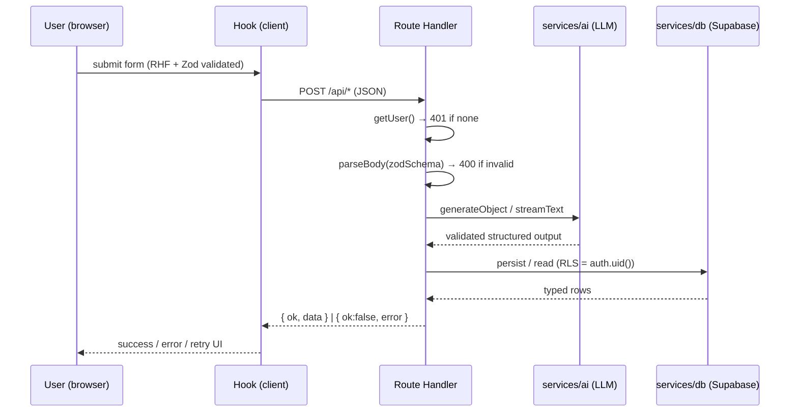

# Architecture — Rewire

How Rewire is built and how a request flows end to end. Pairs with `README.md`
(product) and `CLAUDE.md` (conventions).

---

## 1. Overview

Rewire is a **Next.js 15 (App Router)** app in TypeScript (strict). It is a
GenAI habit-recovery coach: users authenticate, define a habit, and a **real
LLM** generates a personalized recovery plan; progress is tracked over time in
**Supabase Postgres** (protected by Row-Level Security), and several AI features
(adaptive coach, Craving SOS, relapse reframe, form autofill) adapt to the
user's real data.

**Core principle:** one Zod schema per contract, reused across the form, the API
boundary, the AI output, and the UI props — so types never drift.

---

## 2. Tech stack

| Concern | Choice |
|---|---|
| Framework | Next.js 15 App Router, React 19, TypeScript (strict) |
| UI | TailwindCSS v4, shadcn/base-ui primitives, `motion` (animation), `next-themes`, `canvas-confetti` |
| Forms & validation | React Hook Form + Zod (`@hookform/resolvers`) |
| AI | Vercel AI SDK (`ai` + `@ai-sdk/openai`) — `generateObject` (structured) + `streamText` (coach) |
| Auth & data | Supabase (Postgres + Auth + RLS) via `@supabase/ssr` |
| Tests | Vitest |
| Deploy | Vercel |

---

## 3. Folder structure

```
app/                     Routes, layouts, API route handlers (thin)
  layout.tsx               Root layout: fonts, ThemeProvider, Toaster, SEO metadata
  opengraph-image.tsx      Generated social-preview image
  (marketing)/             PUBLIC marketing site (shared nav + footer layout)
    layout.tsx               SiteHeader + SiteFooter chrome
    page.tsx                 Landing page (/)
    about/page.tsx           About page (/about)
  app/page.tsx             PRODUCT home (/app) — auth-gated; Onboarding | Dashboard
  login/page.tsx           Login screen
  auth/callback/route.ts   OAuth code → session exchange
  api/
    habit/route.ts         POST create (validate → generate plan → save) · DELETE reset
    check-in/route.ts      POST upsert a daily check-in
    coach/route.ts         POST streaming adaptive coach reply
    sos/route.ts           POST in-the-moment craving coping response
    suggest/route.ts       POST AI onboarding autofill
    reframe/route.ts       POST compassionate reframe after a slip
components/
  ui/                      shadcn/base-ui primitives only
  shared/                  Cross-feature UI (Field, StatusPanel)
  auth/ onboarding/ dashboard/ plan/ tracker/ progress/ coach/ sos/ theme/ motion/
hooks/                   Client hooks — one per request lifecycle (loading/success/error/retry)
services/
  ai/                      LLM client, prompt builders, generation + error normalisation
  db/                      Supabase queries (server, RLS-scoped)
lib/                     Framework-agnostic helpers (streak math, api-response, confetti, supabase clients)
  supabase/                client (browser) · server (RSC/route) · middleware (session refresh)
types/                   Zod schemas + inferred types — the single source of truth
constants/               Habit categories, triggers, timeframes (enum source of truth)
```

---

## 4. Layered architecture (dependency direction)

Dependencies point **inward**; UI never talks to the LLM or DB directly.

```
Components (client/server)
        │  call
        ▼
Hooks (client lifecycle state)  ──fetch──►  Route Handlers (app/api/*, thin)
                                                │ validate (Zod) · check auth
                                                ▼
                                   Services  ── ai/ (LLM) · db/ (Supabase, RLS)
                                                ▼
                                   types/ (Zod contracts)  ◄── everything derives from here
```

**Rules enforced across the codebase:**
- Route handlers only: authenticate → `parseBody` (Zod) → delegate to a service → `resultResponse`. No business logic.
- Every AI call goes through `services/ai`; every DB call through `services/db`.
- Shared helpers dedupe cross-cutting concerns: `lib/api-response.ts` (parse/respond/errors), `services/ai/errors.ts` (`toAiError`), `lib/streak.ts` (pure streak math), `components/motion` (animation).
- `types/*` Zod schemas are imported by the form, the route, the AI service, and the UI — no duplicated shapes.

---

## 5. Typed, one-directional data flow

```
Auth (Supabase, @supabase/ssr)
  → Form (React Hook Form + Zod input schema)
    → POST /api/*   (route re-validates with the SAME Zod schema — client never trusted)
      → services/ai   (buildPrompt → generateObject/streamText with Zod OUTPUT schema)  ← real LLM
      → services/db   (Supabase queries, RLS-scoped to auth.uid())
        → validated, fully-typed data
          → rendered in Server/Client components
```

### Request lifecycle (Mermaid)



---

## 6. Auth & session flow

Auth is Supabase, wired with `@supabase/ssr`:

- **`lib/supabase/client.ts`** — browser client (Client Components) using the public anon key.
- **`lib/supabase/server.ts`** — server client (Server Components, Route Handlers) reading/writing the session via Next's cookie store.
- **`lib/supabase/middleware.ts`** + **`middleware.ts`** — refresh the session on every request and **gate the product** (`/app/*` → `/login` if signed out). The marketing site (`/`, `/about`), `/login`, and `/auth` are public and SEO-indexable; `/api/*` do their own `getUser()` check.

```mermaid
flowchart TD
  Req[Incoming request] --> MW[middleware: updateSession]
  MW -->|getUser| HasUser{Signed in?}
  HasUser -->|no & private path| Login[/redirect /login/]
  HasUser -->|yes| Page[Server Component / Route]
  Login --> Choice{Sign in method}
  Choice -->|email + password| Pw[signInWithPassword]
  Choice -->|Google| OAuth[signInWithOAuth → Google]
  OAuth --> CB[/auth/callback: exchangeCodeForSession/]
  Pw --> Home[/]
  CB --> Home[/]
```

**Sign-in options:** email/password (with client-side password-strength + confirm), a one-click **demo account**, and **Google OAuth** (gated behind `NEXT_PUBLIC_GOOGLE_OAUTH_ENABLED`; the button is hidden unless the provider is enabled).

---

## 7. Feature request flows

Every AI feature is a **real LLM call** through `services/ai`; structured
features use `generateObject` + a Zod schema, the coach uses `streamText`.

| Feature | Entry (client) | Route | Service | AI shape | Persists? |
|---|---|---|---|---|---|
| **Onboard → plan** | `onboarding-form` → `use-onboarding` | `POST /api/habit` | `generate-plan` → `db/journey.createHabit` | `generateObject(recoveryPlanSchema)` | ✅ `rewire_habits` |
| **Daily check-in** | `tracker-card` → dashboard | `POST /api/check-in` | `db/journey.upsertCheckIn` | — | ✅ `rewire_check_ins` |
| **Adaptive coach** | `coach-chat` → `use-coach` | `POST /api/coach` | `coach.streamCoachReply` (reads journey) | `streamText` (grounded in check-ins) | reads DB |
| **Craving SOS** | `sos-panel` → `use-sos` | `POST /api/sos` | `generate-sos` | `generateObject(sosResponseSchema)` | no |
| **Form autofill** | `onboarding-form` → `use-suggest` | `POST /api/suggest` | `suggest.generateSuggestion` | `generateObject(suggestionSchema)` | no |
| **Relapse reframe** | `tracker-card` → `use-reframe` (on slip) | `POST /api/reframe` | `reframe.generateReframe` | `generateObject(reframeResponseSchema)` | no |
| **Reset journey** | dashboard "Change habit" | `DELETE /api/habit` | `db/journey.deleteJourney` | — | deletes rows |

**Home render decision** (`app/page.tsx`, a Server Component): authenticate →
`getActiveJourney(supabase)` → if none, render `Onboarding`; otherwise render the
tabbed `Dashboard`. A freshly-created journey (0 check-ins) opens on the **My plan**
tab; returning users land on **Today**.

---

## 8. Database & RLS

Two namespaced tables in the shared Supabase project, isolated by Row-Level
Security. Migrations live in Supabase; the plan is stored as JSONB on the habit.

```
rewire_habits
  id, user_id → auth.users, habit_name, category, goal_type (quit|reduce),
  current_amount, target_amount, motivation, triggers text[], timeframe_days,
  plan jsonb, created_at
rewire_check_ins
  id, habit_id → rewire_habits (cascade), user_id → auth.users,
  date, status (win|slip), mood, note, created_at   ·  unique(habit_id, date)
```

**RLS on every table:** policies are `TO authenticated` with an ownership
predicate `(select auth.uid()) = user_id`, and UPDATE policies include
`WITH CHECK` so a row's `user_id` can't be reassigned. Streaks, win-rate and
milestone progress are **derived at read time** (`lib/streak.ts`) — never stored
redundantly.

---

## 9. Security model

- **Every input validated twice** — client (RHF + Zod) and server (same Zod schema at the route).
- **RLS** guarantees per-user isolation even though the DB is shared with another app.
- **Secrets are server-only:** the LLM API key lives only in `services/ai` (server). The browser sees only the RLS-protected Supabase anon key (`NEXT_PUBLIC_*`).
- **Protected routes** gated by middleware; API routes re-check `getUser()`.
- **No mock/hardcoded AI data** anywhere — every plan/nudge/coach/SOS/reframe/autofill is a live LLM request.

---

## 10. Testing

Vitest unit tests target the pure, dependency-free logic (fast, deterministic):

- `lib/streak.test.ts` — streak/slip/edge cases, win totals, day math
- `types/schemas.test.ts` — Zod validation for habit, check-in, SOS, coach
- `services/ai/prompt.test.ts` — prompt builders include the right context
- `services/ai/errors.test.ts` — timeout vs generic error mapping

Run: `pnpm test` · `pnpm typecheck` · `pnpm build`.
