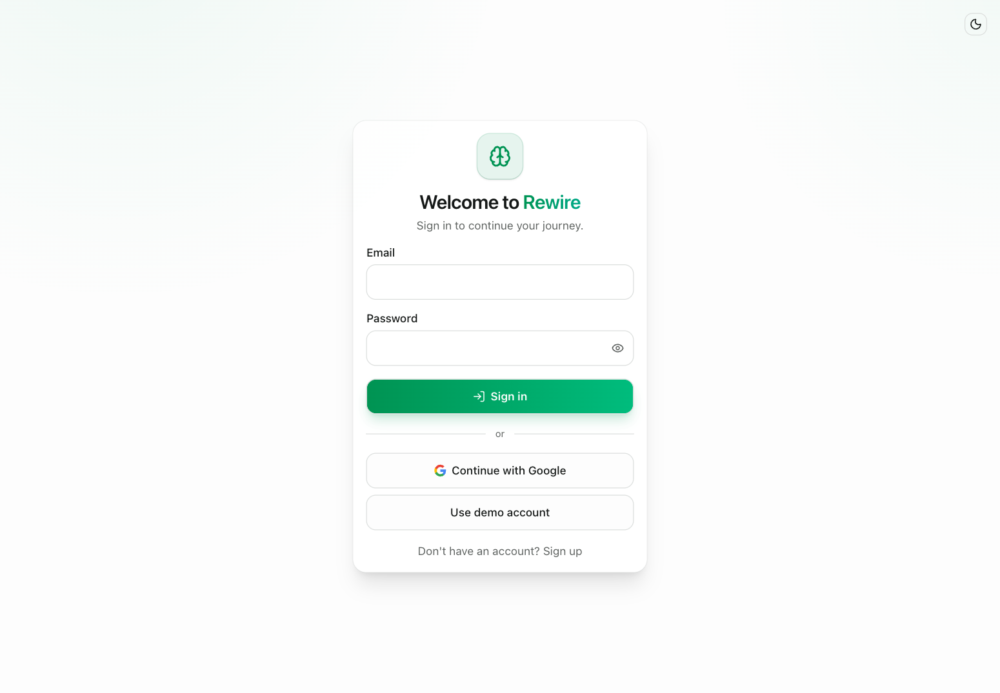
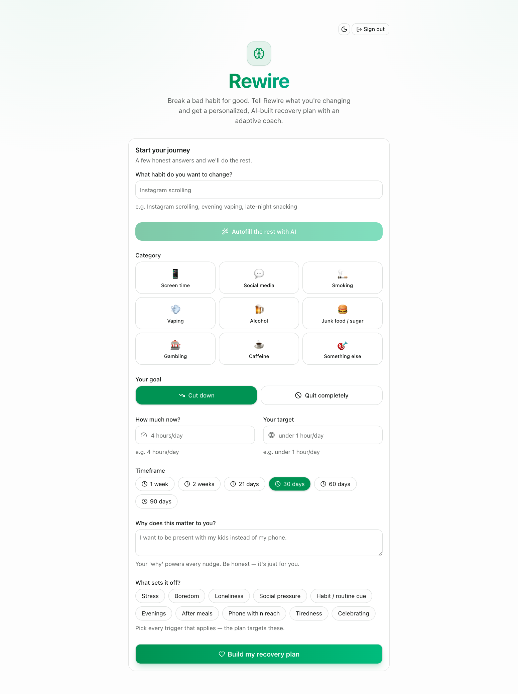
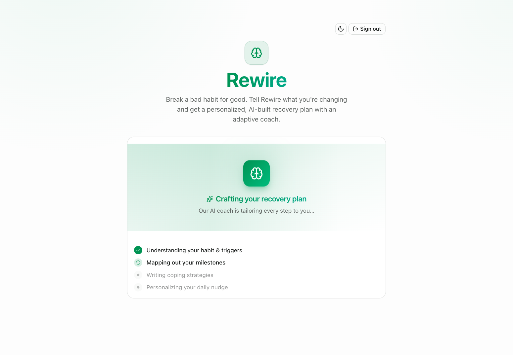
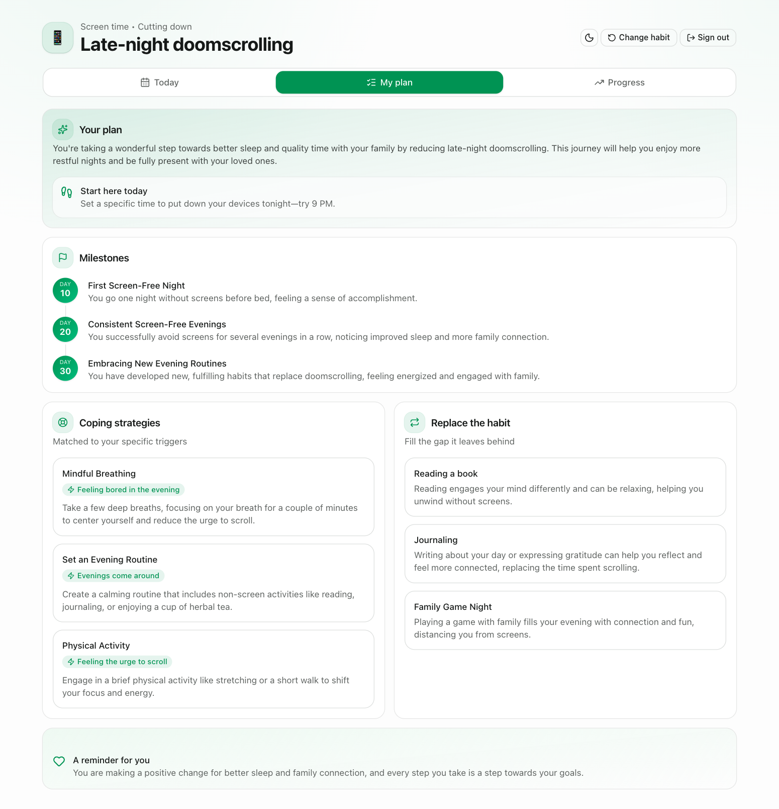
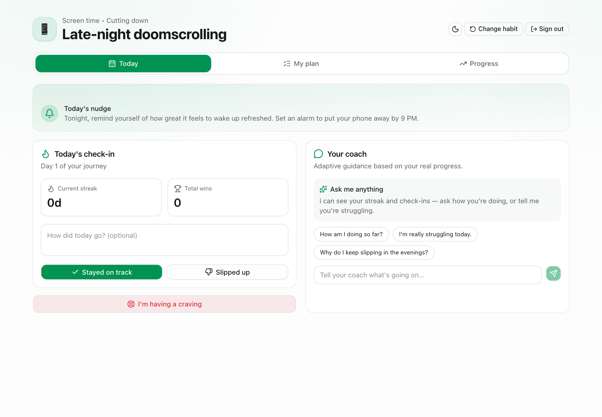
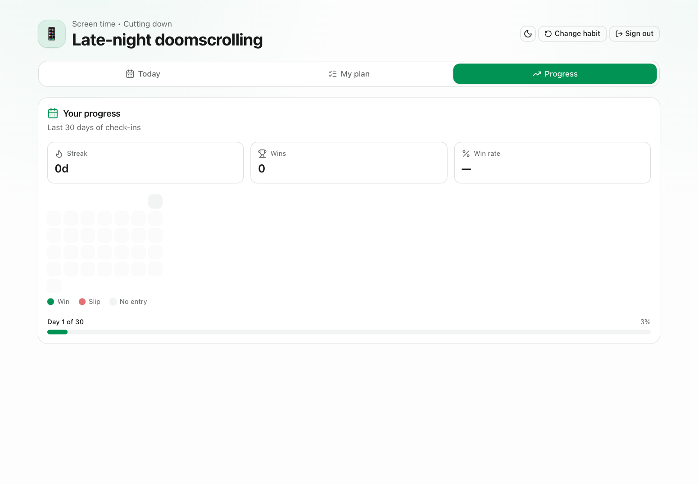

# 🧠 Rewire — AI Habit & Addiction Recovery Coach

**Rewire** is a GenAI web app that helps people reduce or overcome harmful habits — excessive screen time, doomscrolling, smoking, vaping, junk food, and other addictions. It pairs longitudinal tracking with a Generative-AI core that delivers **intelligent nudges, personalized tracking, adaptive coaching, and in-the-moment support** to drive *sustained* behavior change — not a one-off tip.

> Built for the PromptWars Main Challenge: **Breaking Bad Habits & Addiction**.
> See `CLAUDE.md` for build conventions, `PLAN.md` for the build order.

## 🚀 Live demo

**https://rewire-habit-coach.vercel.app**

Sign in with the demo account (or tap **"Use demo account"** on the login screen):

| Email | Password |
|---|---|
| `demo@rewire.app` | `RewireDemo2026!` |

## Screenshots

| Sign in | Onboarding |
|---|---|
|  |  |

| AI generating your plan | Your recovery plan |
|---|---|
|  |  |

| Today (nudge · check-in · coach) | Progress |
|---|---|
|  |  |

---

## The problem

Breaking a habit isn't an information problem — everyone knows screen time is too high. It's a *behavior-change* problem: it requires the right message at the right moment, tracking that reflects real progress, coaching that remembers your history, and support the instant a craving hits. Generic advice and static habit trackers fail because they don't adapt to *you*.

## How Rewire uses Generative AI (the core, not a bolt-on)

Every intelligent output is produced by a **real LLM** through the Vercel AI SDK — `generateObject` + Zod schemas for structured features (valid, fully-typed data, no text parsing) and `streamText` for the coach. No mock or hardcoded responses anywhere.

- **Personalized recovery plan** — from your habit, motivation, current amount, and triggers, the AI generates a staged quit-or-reduce plan: milestones, trigger-specific coping strategies, replacement behaviors, a daily nudge, and an affirmation tailored to *your* habit.
- **Adaptive coach (chat)** — a streaming AI coach grounded server-side in your real tracked progress — it knows your current streak, wins/slips, and trigger patterns, so its guidance changes as you do.
- **Craving SOS** — one tap during an urge returns an instant, structured coping response: grounding steps, a distraction, a reframe of *why you started*, and how long the urge should last.
- **AI form autofill** — type the habit you want to change and the AI prefills the entire onboarding form (category, goal, likely triggers, an example motivation, a sensible timeframe) — all editable.
- **AI relapse reframe** — logging a slip returns a compassionate reframe + one get-back-on-track step, turning a slip into a recovery moment instead of a failure.

> **Roadmap:** weekly AI reflection over your data, richer trigger analytics, reminders/notifications.

## Features

- **Accounts** — email/password auth (Supabase) with a one-click **"Use demo account"** button, so your journey persists across sessions and devices.
- **Habit-agnostic onboarding** — define any habit (with excessive screen time as the flagship example): whether to *quit* or *reduce*, your current amount, your target, your "why", your known triggers, and a timeframe.
- **Daily check-ins** — log status (win / slip) with an optional note. Fast, low-friction, one screen. Stored per-user in Postgres.
- **Progress visualization** — a check-in heatmap, current streak, win-rate, and a timeframe progress bar, all derived from your check-in history.
- **Supportive by default** — a slip is met with an AI reframe and encouragement, not shame, because shame drives relapse.
- **Polished, animated UX** — "ChatGPT meets Notion": motion transitions, ambient gradients, glass surfaces, a light/dark theme toggle, confetti on wins, skeleton loaders, empty states, and a full request lifecycle (loading, success, failure, retry, timeout). Reduced-motion respected.

## Tech stack

- **Next.js 15** (App Router) + **TypeScript** (strict)
- **TailwindCSS** + **shadcn/ui**
- **React Hook Form** + **Zod** — one schema validates the form *and* the AI output
- **Vercel AI SDK** — `generateObject` for structured outputs + `streamText` for the coach chat, backed by a **real LLM**
- **Supabase** — Postgres + Auth + Row-Level Security for per-user data
- **motion** (animations), **next-themes** (light/dark), **canvas-confetti** (celebrations)
- **Vitest** — unit tests for pure logic (streak, prompts, schemas, error mapping)
- Deployed on **Vercel**

## Architecture

Typed, one-directional flow. Zod schemas in `types/` are the single source of truth — the same schema validates the form input, the API boundary, and the AI's structured output. RLS guarantees a user can only ever read or write their own rows.

```
Auth (Supabase)
  → Form (RHF + Zod)
    → POST /api/*  (Route Handler re-validates with the SAME Zod schema)
      → services/ai   (build prompt, generateObject with Zod OUTPUT schema)   ← real LLM
      → services/db   (Supabase, RLS-scoped to the signed-in user)
        → validated, typed data
          → rendered in Server/Client components
```

```
app/            Routes, layouts, API route handlers (thin)
components/      Feature UI          components/ui/  shadcn primitives
hooks/          Client hooks        lib/  utils/    Helpers & pure logic
services/ai/    LLM client, prompt builders, structured generation
services/db/    Supabase client & queries (server-only, RLS-scoped)
types/          Zod schemas + inferred types (single source of truth)
constants/      Habit types, trigger options, config
```

See **`ARCHITECTURE.md`** for the full layered architecture, per-feature request flows, the auth/session model, and diagrams. Conventions and rationale live in `CLAUDE.md`.

## Data model (Supabase)

Per-user, protected by Row-Level Security (`TO authenticated` + an `auth.uid() = user_id` ownership predicate on every policy). Tables are namespaced `rewire_*`:

- **`rewire_habits`** — the habit being changed (name, category, quit-or-reduce, current amount, target, motivation, triggers, timeframe) plus the AI-generated `plan` stored as JSONB.
- **`rewire_check_ins`** — daily logs: date, status (win/slip), optional mood and note. One row per habit per day.

Streaks and total wins are **derived** from `rewire_check_ins` at read time — never stored redundantly.

## Getting started

### Prerequisites

- Node.js 18.18+ (or 20+)
- pnpm
- A Supabase project (URL + keys)
- An API key for the LLM provider

### Setup

```bash
pnpm install
cp .env.example .env.local   # then fill in your keys
pnpm dev                     # http://localhost:3000
```

### Scripts

```bash
pnpm dev         # start dev server
pnpm build       # production build
pnpm start       # run the production build
pnpm lint        # lint
pnpm typecheck   # tsc --noEmit
```

## Environment variables

Copy `.env.example` to `.env.local` and set:

| Variable | Required | Description |
|---|---|---|
| `OPENAI_API_KEY` | ✅ | LLM API key. **Server-only** — used exclusively inside `services/ai`. |
| `NEXT_PUBLIC_SUPABASE_URL` | ✅ | Supabase project URL (public). |
| `NEXT_PUBLIC_SUPABASE_ANON_KEY` | ✅ | Supabase anon/publishable key (public — RLS enforces per-user access). |
| `OPENAI_MODEL` | optional | Model id override (defaults to `gpt-4o-mini`). |

> The LLM key is used exclusively on the server, never sent to the browser, and never committed — `.env.local` is git-ignored. No service-role key is needed: the app talks to Supabase as the signed-in user, and RLS does the rest.

## Security

- **Every input is validated** on both client and server with the same Zod schema.
- **Row-Level Security** on all tables — a user can only access their own habits and check-ins.
- Secrets are **server-only**; the browser only ever sees the RLS-protected anon key.
- Every API path handles errors explicitly — loading, success, failure, retry, and timeout.

## Deployment (Vercel)

1. Push the repo to GitHub.
2. Import the project in Vercel.
3. Add the environment variables from the table above in **Project → Settings → Environment Variables**.
4. Deploy. The App Router build is Vercel-ready out of the box.

## Notes

- **No mock data.** Every plan, nudge, SOS response, and coach reply is generated by a real LLM request — there are no hardcoded or placeholder AI responses anywhere in the app.
- **Structured output is enforced by Zod**, so the UI always receives valid, fully-typed data.
- **Supportive by design.** Rewire reframes slips instead of shaming them, because shame drives relapse — the coaching tone is a product decision, not an accident.
